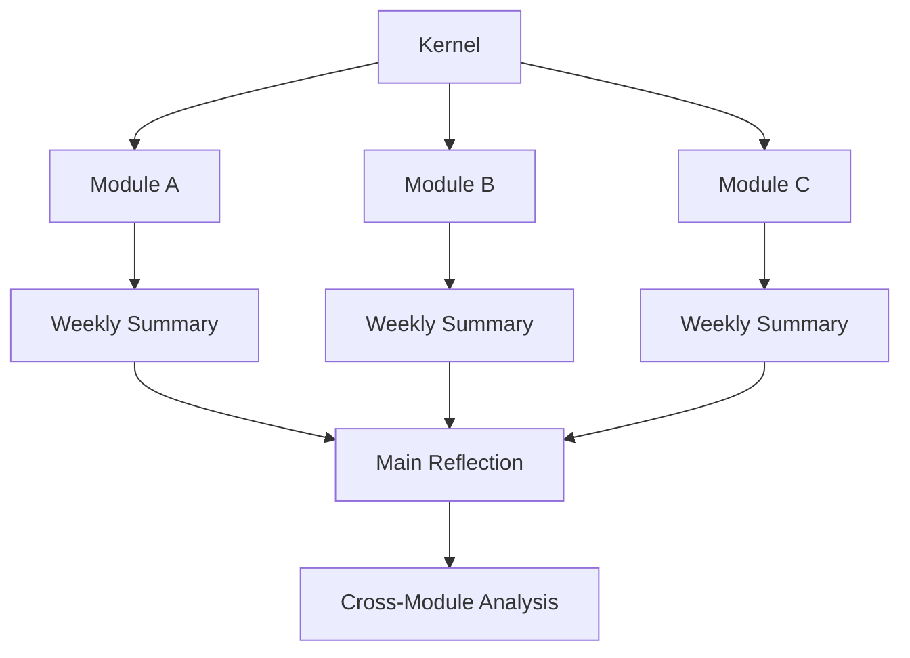

# Human Reflection Architecture


[](#contributing)

> Human Reflection Architecture is not a productivity system.
> It is a framework for preserving and improving human judgment in the age of AI.

This repository is not about making AI think better.

It is about helping humans think better while using AI.

## Why?

Large Language Models are becoming better at generating answers.

However, generating answers is not the same as improving human judgment.

This project explores a different question:

> How can AI help humans think better without replacing their judgment?

## Core Principle

AI does not decide.

AI remembers.

AI connects.

AI challenges assumptions.

Humans decide.

## What is Human Reflection Architecture?



 ## Design Philosophy

- Human reflection comes before AI analysis.
- Long-term patterns matter more than isolated events.
- AI should challenge ideas, not replace them.
- Evidence is preferred over intuition.
- Judgment evolves through repeated reflection.
- Reflection is iterative, not instantaneous.

## What this project is NOT

❌ An AI Agent

❌ A Prompt Collection

❌ A Productivity System

❌ A Memory Database

❌ A personal diary

✅ A reflection architecture

✅ A judgment framework

✅ A long-term thinking system

## Repository Structure
```text
human-reflection-architecture/
│
├── kernel/
├── docs/
├── examples/
└── assets/
```

## Roadmap

### v1.0

- [x] Reflection Kernel
- [x] Core Principle
- [ ] Documentation
- [ ] Examples
- [ ] Community Feedback
- [ ] v1.1 Planning

## Current Status

Human Reflection Architecture is currently in its first public draft (v1.0).

The goal of this release is not to present a finished framework, but to gather feedback, challenge assumptions, and improve the architecture through real-world discussion.

## Example

### Example 1 — Weekly Reflection

Daily Activities

- Finished C programming exercises
- Worked on a personal project
- Exercised twice
- Read *Thinking 101*

↓

Weekly Reflection

- What did I learn?
- What surprised me?
- What mistake did I repeat?
- What did I do well?
- What should I focus on next week?

↓

Cross-Module Pattern

Repeated pattern detected:

> "I tend to over-design before implementation."

↓

Updated Judgment

> "Build an MVP first. Collect evidence. Improve later."

### Example 2 — Evidence Before Expansion

Observation

> "I think this architecture needs another module."

↓

AI Counterargument

> "What evidence suggests the current design is insufficient?"

↓

Reflection

"There is no implementation evidence yet."

↓

Decision

Do not add a new module.

Implement an MVP first.

Collect evidence.

Review in v1.1.

This example illustrates how reflection changes judgment over time,
rather than simply recording past events.

## Contributing

This architecture is intentionally incomplete.

If you find assumptions that are weak, missing principles, or better reflection patterns, discussions and pull requests are welcome.

# Goal

The goal of this repository is not to teach AI how to think.

It is to help humans preserve and continuously improve their own judgment in an age where AI can answer almost everything.

---

> Think first.
>
> Reflect second.
>
> Use AI third.
